# Nerf：Neural  Radiance Fields  

# 辐射神经场

评价：

NeRF 把整个三维空间的几何信息与 texture 信息全部用一个 MLP 的权重来表达

优点：

显式3D表示变为隐式，显式：离散化，内存消耗大

缺点：1.一个模型只能表达一个场景，且优化一个场景耗时久；

         2.per-pixel 渲染较为低效；

         3.泛化能力较差，一个场景需要较多的照片才能训练好。

神经辐射场：在整个时空，我们对坐标进行采样并将其馈入神经网络以产生场量。场量是重建域的样本（所求）。然后，我们应用一个前向映射将重建与传感器域（例如RGB图像）相关联，（可监督的)。最后，我们通过将重建信号与传感器测量进行比较来计算指导神经网络优化过程的重建误差或损失。

使用全连接的深度网络，输入是5D的坐标（spatial location (x, y, z) and viewing direction (θ, φ)），输出是体密度和基于视图的发射光。

通过查询沿相机光线的5D坐标来合成视图，并使用经典的体渲染技术将输出颜色和密度投影到图像中。

把静态场景表征成连续的5D函数：输出在每个方向、每个点上的射线以及射线上每个点的密度像是不透明度，控制着当射线穿过xyz时辐射是如何累积的。

通过全连接把5维坐标变成独立的体密度和RGB值

### 渲染render Nerf的步骤：

step1: ray marching ：生成点集

step2: 5D input输入神经网络中，输出color和densities

step3：体渲染：把color和密度累积映射到 2D 图像中

optimize：gradient descent ：“between each observed image and the corresponding views rendered from our representation” ([Mildenhall, p. 406](zotero://select/library/items/WS36WRC2)) ([pdf](zotero://open-pdf/library/items/DBKPRMIN?page=2))

跨视角的优化：使网络预测一个包含真实底层场景的联合的模型，分配高体素密度和精确的颜色

### issue:

”We find that the basic implementation of optimizing a neural radiance field representation for a complex scene does not converge to a sufficiently highresolution representation and is inefficient in the required number of samples per camera ray.” 复杂场景的神经辐射场表示优化的基本方法不会收敛到足够的高分辨率，并且每个相机射线的sample是低效的。

### 创新点：

1、5D coordinates with positional encoding   --->MLP 表示

2、分层采样：减少了采足够多的样本所需要的query次数

## 总结：

1、一种将具有复杂几何形状和材料的连续场景表示为 5D 神经辐射场的方法，参数化为基本 MLP 网络。

2、优化：基于传统体素渲染的可微渲染策略，内含分层采样策略来把mlp的容量分配给可见场景空间。

3、positional encoding：将5D输入map到更高维空间，来更好的表示高频空间。

## 一、Neural Radiance Field Scene Representation

Referred in [Nerf](zotero://note/u/TAC7Q2SY/?ignore=1&line=-1)

把连续场景表示成5D的方法，输入是3D location x =(x, y, z) and 2D viewing direction (θ, φ)，输出是射出的颜色 c =(r, g, b) and volume density σ（每个点的）

（实际上，方向表示成三维的单位向量d）

这种表示是用MLP网络表示的。

多视角是通过限制：预测体密度的方法是关于位置x的，预测颜色的方法是关于位置和视角方向的。

实际操作：8层全连接的MLP，输入三维坐标x，输出体密度和256维的特征向量。这个特征向量与入射视角串联，再过1层全连接，输出视角独立的颜色值。

去掉视角独立：镜面反射无。

去掉位置编码：高频几何和纹理的能力下降。

## 二、Volume Rendering with Radiance Fields

“differential probability” ([Mildenhall, p. 409](zotero://select/library/items/WS36WRC2)) ([pdf](zotero://open-pdf/library/items/DBKPRMIN?page=5)) 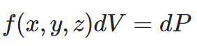

体密度σ(x)可以解释为光射线在位置 x 处的无穷小粒子处终止的微分概率

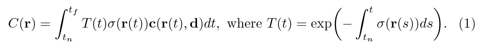 ([pdf](zotero://open-pdf/library/items/DBKPRMIN?page=6&annotation=B8T5IB2J))  
([Mildenhall, p. 410](zotero://select/library/items/WS36WRC2))

T(t)：从tn到t的累计透明度，*也就是光线从* tn *传播到* t *而没有碰到任何其他粒子（仍存活）的概率。*

σ(r(t))：在r这条射线上，t位置的体积密度

c(r(t), d)：在r这条射线上，t位置对d方向的光强/颜色值

离散化：

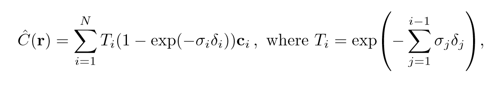 ([pdf](zotero://open-pdf/library/items/DBKPRMIN?page=6&annotation=XYB2U4VA))  
([Mildenhall, p. 410](zotero://select/library/items/WS36WRC2)) 方法：先离散化c_i这部分，T(t)用定积分形式表示，然后从T(t)中将T_i构造出来，并作为与t无关的常数，直接放到积分外。

## 三、Optimizing a Neural Radiance Field

1、positional encoding：帮助 MLP 表示高频函数

issue：高频变量表征不好

解释：由于颜色c和光密度σ在空间中并不是平滑的，变化是比较剧烈的，这意味着函数存在很多高频的部分，而深度网络偏向于学习低频函数，所以让模型去表示这种函数比较困难，所以NeRF通过**positional encoding**，对输入的r,d进行编码、升维，从而能够让模型更好地学出场景的一些细节部分

solution：mapping the input to a higher dim space using high frequency function before network

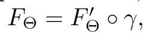 ([pdf](zotero://open-pdf/library/items/DBKPRMIN?page=7&annotation=7R363259))

γ is a mapping from R into a higher dimensional space R2L, and F ′ Θ is still simply a regular MLP

γ 方法分别对x的三维坐标（先归一）做三次（each of the three coordinate values in x），对d三维向量（先归一）做三次。

set L =10forγ(x)andL =4forγ(d).

事实上在官方的代码实现中，输入的是 (p,γ(p)) 

2、Hierarchical Volume Sampling：分层采样

根据对最终渲染的预期效果按比例分配样本

issue：N query 效率低下的问题（对空空间和重叠部分仍重复采样）

我想要的是：密集的部分进行更多的采样，根据对最终渲染的贡献按比例分配样本

solution：simultaneously optimize two networks: one “coarse” and one “fine”

同时优化两个网络：一个“粗”和一个“细”

粗网络：sample a set of Nc locations using stratified分层 sampling

对光线均匀采样（均匀划分N份，从每一小段里随机抽一个样本），优化公式2，3

Eq. 2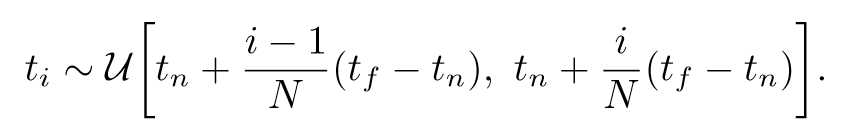 ([pdf](zotero://open-pdf/library/items/DBKPRMIN?page=6&annotation=AIMW3ENV))

near 到 far 取 N 段，服从每一段里面的均匀分布

Eq. 3 ([pdf](zotero://open-pdf/library/items/DBKPRMIN?page=6&annotation=XYB2U4VA))  
细网络：根据 coarse 网络预测的体密度值，对光线的分布进行估计，然后根据估计出的分布进行第二次重要性采样，      沿射线sample偏向相关体素的

重写C(r)：

Eq. 5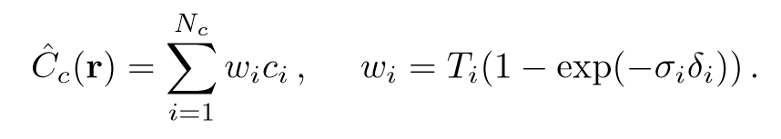 ([pdf](zotero://open-pdf/library/items/DBKPRMIN?page=8&annotation=SATB9WY7))

归一化权重，沿射线生成piecewise constant PDF，用逆变换采样，采样第二组位置Nf。evaluate：用粗细两组采样点，用Eq. 3计算最终渲染颜色Cf(r).

此过程将更多样本分配给我们期望包含可见内容的区域。这解决了与重要性采样类似的目标，但我们将采样值用作整个积分域的非均匀离散化，而不是将每个样本视为整个积分的独立概率估计。

piecewise-constant PDF分段常数概率密度函数：bin the data to produce a histogram, and then construct a distribution from the histogram. This way, we model the probability density function (PDF) as a piecewise constant function.是概率密度函数，但是是分段常数

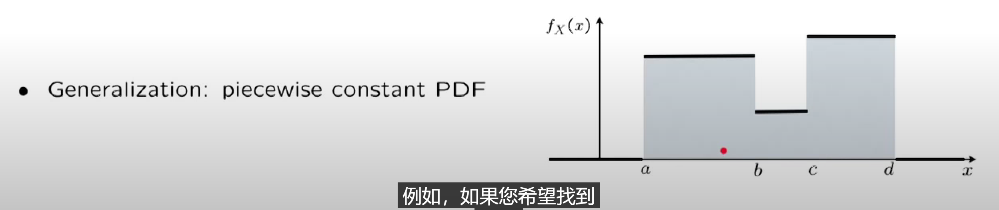

实施步骤：

我们为每个场景优化了一个单独的神经连续体积表示网络。这只需要一个数据集，包含场景的捕获 RGB 图像、相应的相机位姿和内参以及场景边界（我们使用地面实况相机位姿、内在因素和边界来处理合成数据，并使用 COLMAP 运动结构包\[38\] 为真实数据估计这些参数）。在每次优化迭代中，我们从数据集中所有像素的集合中随机采样一批相机光线，然后按照第 5.2 节中描述的分层采样，从粗网络中查询 Nc 个样本，从细网络中查询 Nc + Nf 个样本。然后我们使用第 4 节中描述的体积渲染过程，渲染来自两组样本的每条光线的颜色。损失是粗略和精细渲染的渲染像素颜色和真实像素颜色之间的总平方误差：

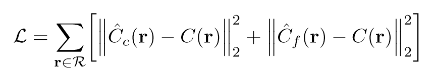 ([pdf](zotero://open-pdf/library/items/DBKPRMIN?page=9&annotation=DCY8HM32))  
1、为每个场景生成单独的神经连续体积表示网络  
2、每次迭代优化：从所有像素集中随机采样一批相机光线，分层采样点，粗网络Nc个样本，细网络Nc + Nf 个样本  
3、体渲染：渲染两组样本的每条光线的颜色  
损失：像素颜色总平方误差

-   先将这些位置输入MLP以产生volume density和RGB颜色值；
-   取不同的位置，使用体积渲染技术将这些值合成为一张完整的图像；
-   因为体积渲染函数是可微的，所以可以通过最小化上一步渲染合成的、真实图像之间的差来训练优化NeRF场景表示。

# ？？？

### 1、positional encoding   γ 方程怎么来的  L为什么取10和4    

(1)  γ 方程：与Transformer中PE一样，取正余弦函数，因为是周期的，可以通过控制α来调节位置编码函数的波长，α大，相邻变化小，α小，相邻变化大。----->相对位置

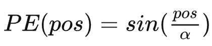

存在问题：α小，在长文本中还是可能会有一些不同位置的字符的编码一样；α大，相邻词之间差异小

所以，升维，在**不同维度上用不同的函数操纵位置编码**：\[−1,1\]dmodel 的范围远大于\[-1,1\]

用d维，每一维用不同的α，或正余弦函数。

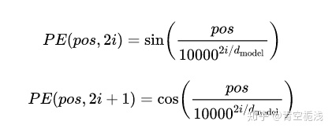

（2）10，4 超参数  

实际维数：x:   R  ---->  R20

               d:   R  ---->  R8

### 2、如何离散化的

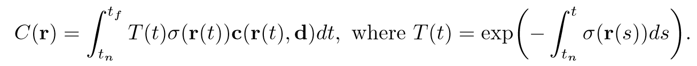 ([pdf](zotero://open-pdf/library/items/DBKPRMIN?page=6&annotation=8MRRMPZP))  
                                                ||

 ([pdf](zotero://open-pdf/library/items/DBKPRMIN?page=6&annotation=XYB2U4VA))  
([Mildenhall, p. 410](zotero://select/library/items/WS36WRC2)) 先离散化c_i这部分，T(t)用定积分形式表示，然后从T(t)中将T_i构造出来，并作为与t无关的常数，直接放到积分外。

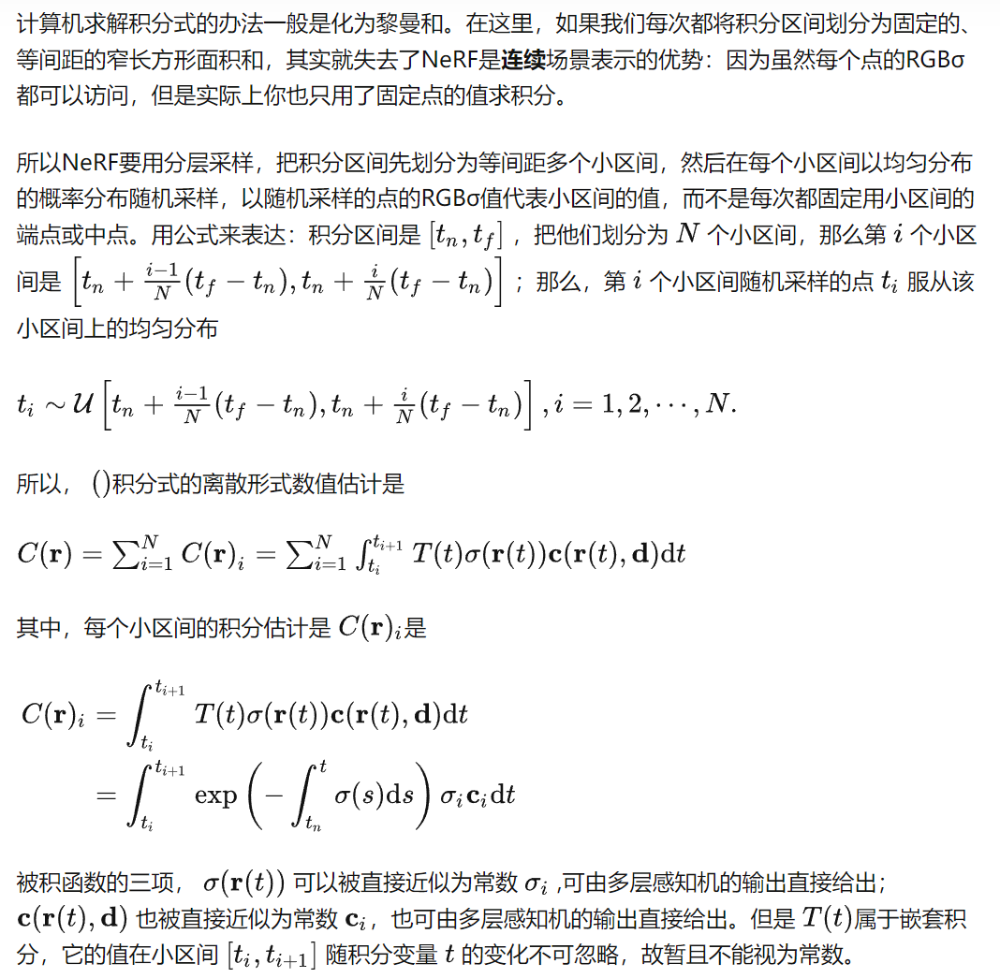

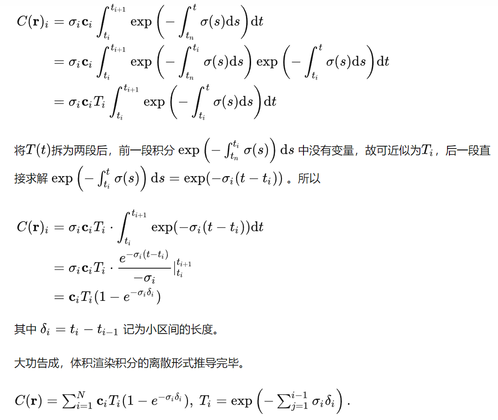

### 3、如何分层采样

背景知识：

1、piecewise constant PDF：概率密度函数（分段常数函数）

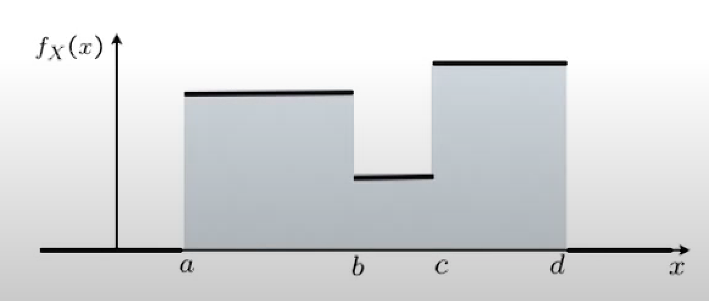

面积之和=1

2、逆变换采样

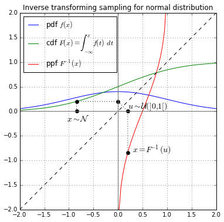

知道任意随机概率分布的累计函数后，可以从该分布中生成随机样本

连续随机变量X，累计分布函数F(X)

步骤：

1、先采样为稀疏的Nc个点，在粗网络上计算渲染结果。

2、改写离散求和函数。

 ([pdf](zotero://open-pdf/library/items/DBKPRMIN?page=8&annotation=SATB9WY7))

3、对权重 wi 求归一化，归一结果可看作是wi在射线方向上的概率密度函数

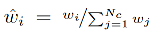

wi在射线方向上的概率密度函数，通过这个概率密度函数，我们可以粗略地得到射线方向上物体的分布情况：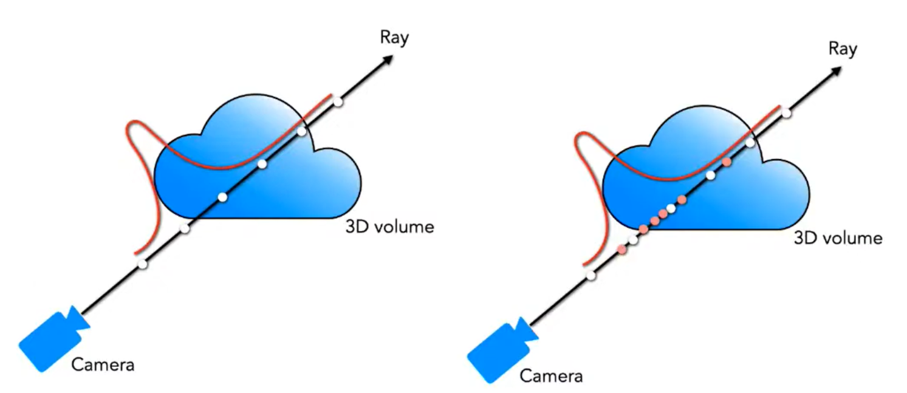

4、得到累计密度函数，逆变换采样，获得 Nf 采样

5、Nc \+ Nf 送入细网络学习

## Nf证明：

wi是Nc关于不透明度的值  
把他归一化后，形成了沿射线的分段常数概率密度函数  
有了概率密度函数相当于有了分布PDF=f(x)=分段（a,b,c,d.....)，然后通过逆变换采样，f-(a)=x1  
a取任意的分布函数（均匀采样），生成之前NC未采样的点。

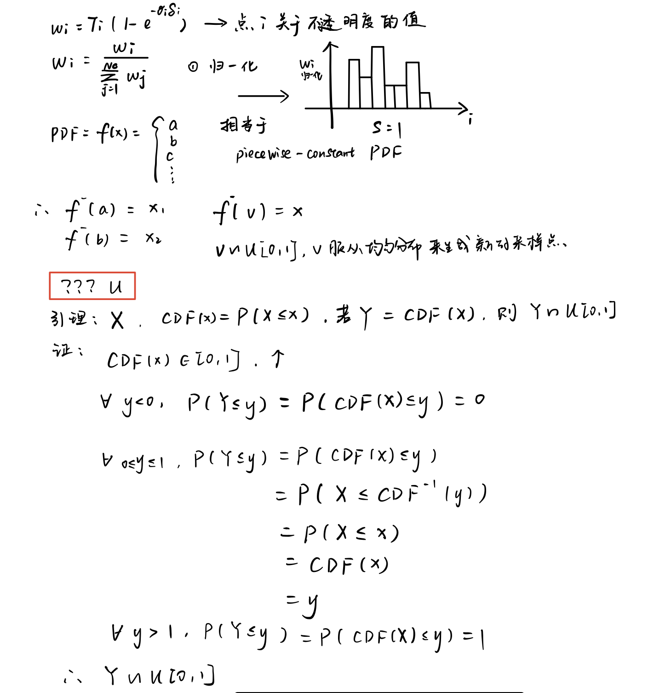

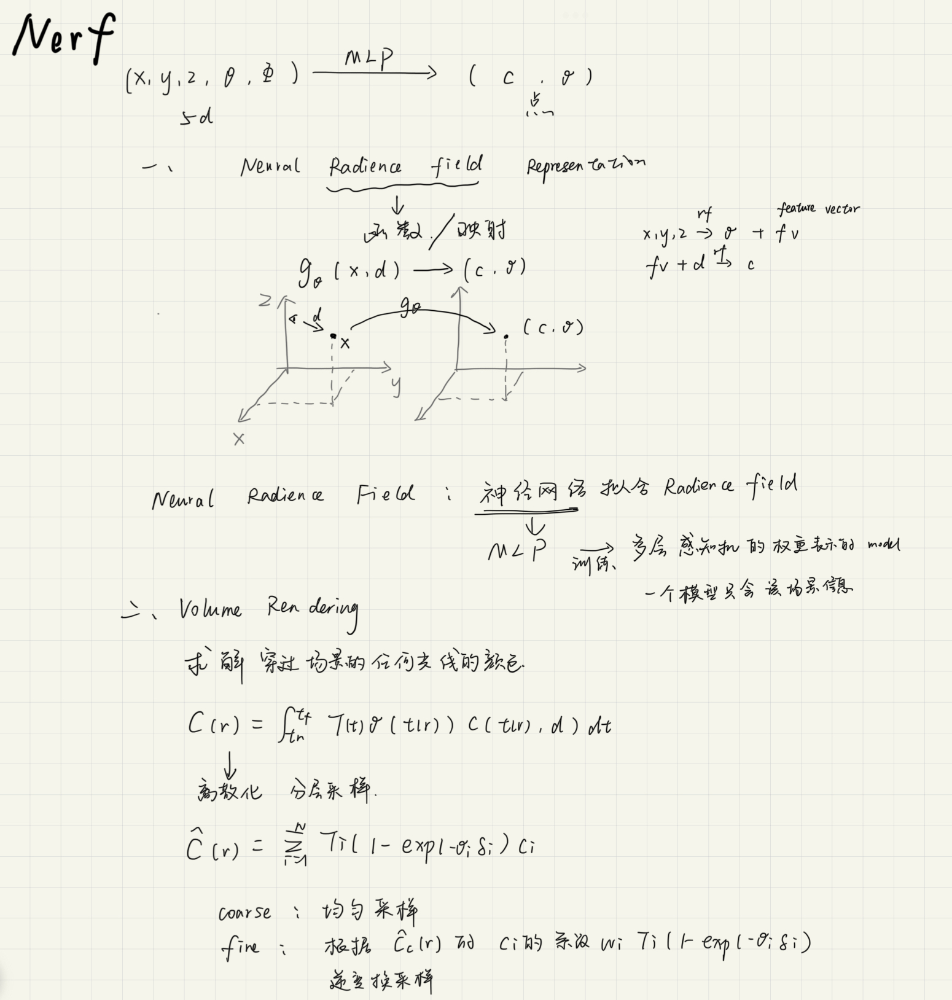

Referred in [Nerf](zotero://note/u/TAC7Q2SY/?ignore=1&line=-1)